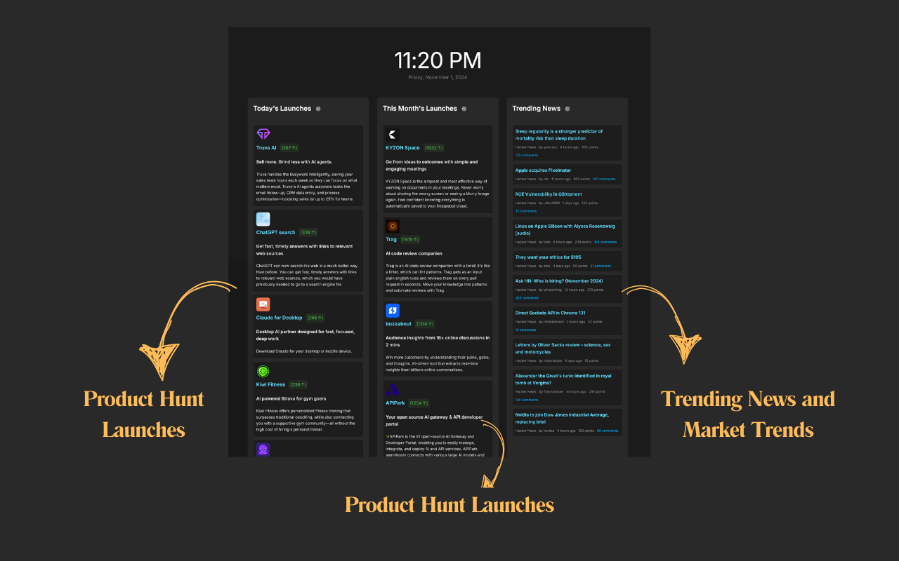
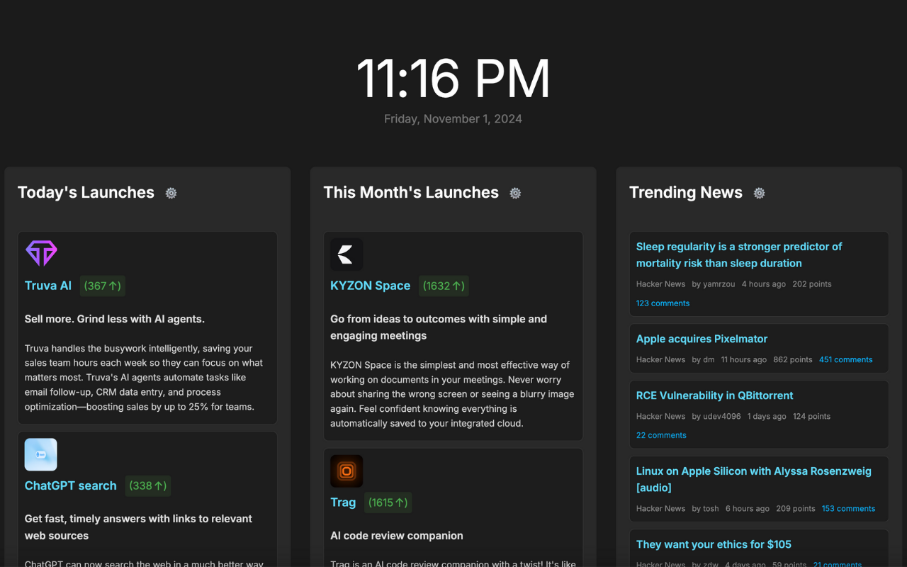
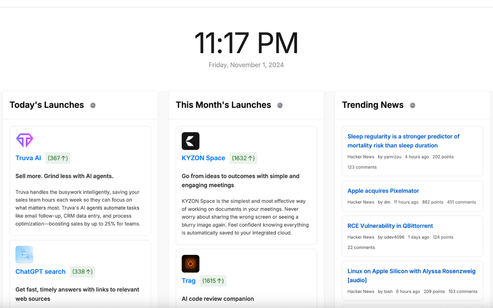
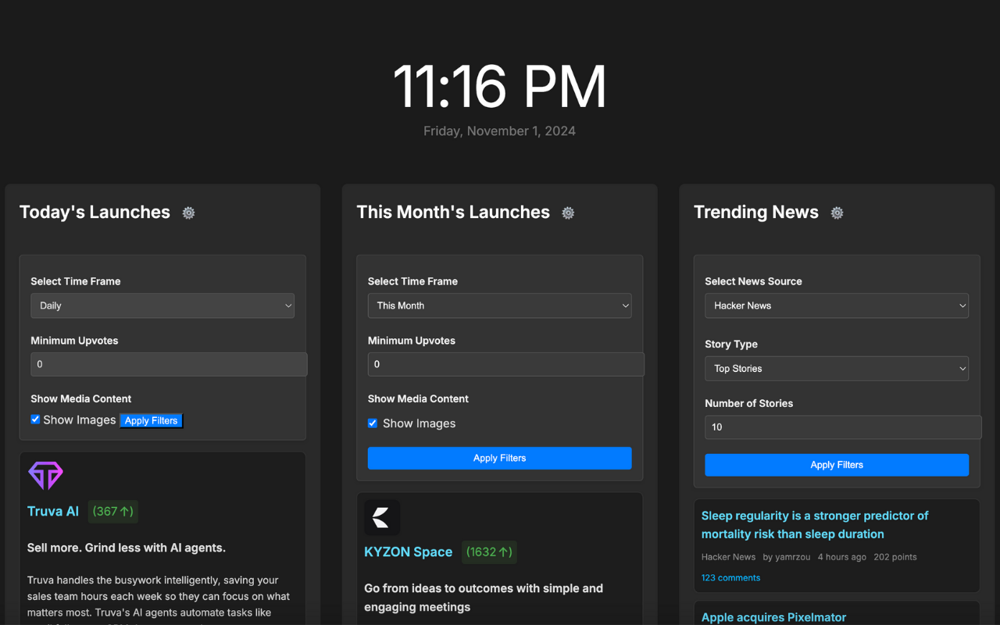

# SaaS Inspiration Hub – A New Tab Chrome Extension

Transform your new tab into a dynamic SaaS inspiration dashboard! Stay ahead in the fast-paced tech world with a beautifully designed interface that brings you the hottest Product Hunt launches, top monthly products, and trending tech news—all in one place.

## Features
- 🚀 **Today's Product Hunt Launches**: Real-time updates of trending products with upvote counts
- 📈 **Monthly Top Launches**: Track the most successful product launches and trends
- 📰 **Trending Tech News**: Latest updates from Hacker News with engagement metrics
- 🌓 **Dark/Light Mode**: Comfortable viewing in any lighting condition
- ⚙️ **Customizable Filters**: Filter content by time frame and popularity
- ⏰ **Elegant Time Display**: Keep track of time with style

## Screenshots

Click to view more screenshots

### Dark Mode

### Light Mode

### Filters

## Installation

### Chrome Web Store
Install directly from the [Chrome Web Store](https://chromewebstore.google.com/detail/saas-inspiration-hub-a-ne/agphhkieiohhocaidlihglomljmfagak)

### Local Development
1. Clone the repository

## Usage
- Open a new tab to view your SaaS inspiration dashboard
- Toggle between dark and light modes using the moon icon
- Use filter icons to customize content based on time frame and popularity
- Click on any item to open it in a new tab

## FAQs

**Q: How often is the content updated?**
A: Content is refreshed in real-time when you open a new tab.

**Q: Does it work offline?**
A: The extension requires an internet connection to fetch the latest updates.

**Q: How do I customize the filters?**
A: Click the ⚙️ icon in each section header to access filter options.

## Support
For support, feedback, or suggestions, please contact us at [support@laksha.net](mailto:support@laksha.net)

## Contributing
1. Fork the repository
2. Create your feature branch (`git checkout -b feature/AmazingFeature`)
3. Commit your changes (`git commit -m 'Add some AmazingFeature'`)
4. Push to the branch (`git push origin feature/AmazingFeature`)
5. Open a Pull Request

## License
This project is licensed under the MIT License - see the [LICENSE](LICENSE) file for details

---

**Made with ❤️ for the SaaS community**
